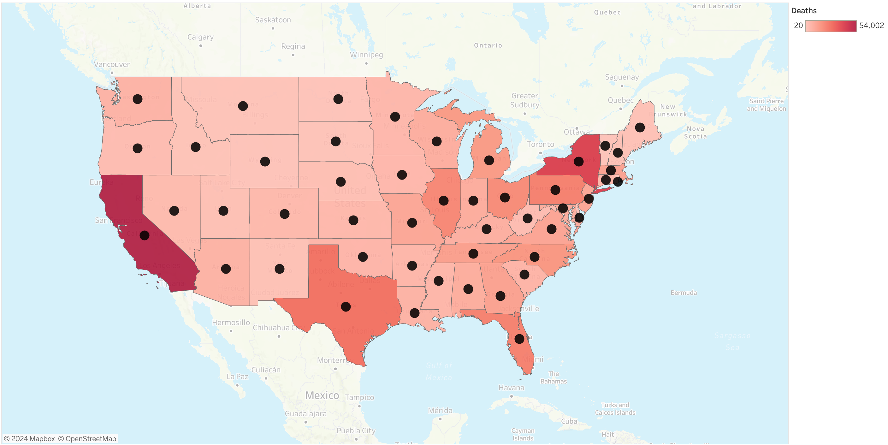

# Data Analyst

Data Analyst with a background in real estate and supply chain management. Competent in using Excel, SQL, Python, and Tableau to transform unorganized dirty data to clear cut data-based solutions.

#### Technical Skills: Python, SQL, Excel, Tableau, NetSuite, Zendesk, HelpScout, SkySlope, Microsoft Office

## Education

- Certificate on Data Analytics; Career Foundry (_04/23 to 03/24_)								       		
- BBA, Operations Management; Baruch College (_'16 to '20_)

## Work Experience
**Commission Specialist @ Compass**
**Financial Services & Transaction Operations**
**(_03/21 - Present_)**
- Primary challenge is to provide accurate and efficient payments for Compass agents across Illinois, Minnesota, and Wisconsin that follows each addresses’ specific payment structure and the contract terms.
- Actions taken to address such challenge is processing and quality checking deals, maintaining compliance while keeping team’s exceptions in order to get payments out to agents in a timely manner.
- Results in 2023 included 100% of transactions paid under 2 business days after closing and a sub 1% payment inaccuracy rate.

**Real Estate Intern @ Berko & Associates**
**(_09/19 - 11/19_)**
- Real estate agents prioritize outside of office tasks that have highest impact. As a result, the primary challenge are tasks within the office that must be completed before and after closings.
- Actions within the office include acting as a scribe- note taking during meetings, initiating cold calls, identifying compliant documentation and general data base management.
- Resulting in agents being able to prioritize outside tasks while ensuring within office tasks to be completed.
  
**Guided Tour Assistant @ September 11 Memorial & Museum;**
**(_06/19 - 08/19_)**
- 911 Memorial Museum has thousands of visitors daily. Many wanting an enhanced experiences such as a guided tour. Primary challenge is the pre planning and setup for these specialized tours.
- Actions included fulfilling cashier responsibilities, organizing the scheduling, proper queuing, activating audio devices, and answering questions pertaining to this tour.
- Logistics of the guided tour was upheld, allowing for an in-depth visitor experience and a stable transition for the primary tour guides.

**Strength Coach @ Brooklyn Barbell**
**(_02/17 - 09/17_)**
- Primary challenge, CrossFit gym members wanted a strength focus class. Provided the service as a strength coach by hosting a strength training class 3x a week with up to 10 members.
- Provided detailed instructions, critiques of technical execution, structured programming, orderliness of classes pertaining to strength focus barbell movements.
- Results included members improving their size, strength, muscular endurance, will-power, lifestyle habits, and confidence.

## Projects
### New York Housing in 2024 (Python)
- [Tableau Storyboard](https://public.tableau.com/views/NewYorkCityHousingGuideFinal/Story1?:language=en-US&:sid=&:display_count=n&:origin=viz_share_link)
- [Github](https://github.com/WinsonTom/New-York-City-Housing-Guide)
  
1. Homebuyers want to understand neighborhoods rather than just a specific address.
2. Data goes through cleaning, wrangling, merging with other data sources, and mapped through the use of GeoJson files on Python.
3. Homebuyers have an easy-to-use Tableau storyboard which has a bird’s eye view of any key statistic about NYC neighborhoods.

### Preparing for Flu Season (Excel)
- [Tableau Storyboard](https://public.tableau.com/shared/CS3B9RZFG?:display_count=n&:origin=viz_share_link)

1. Staffing demands in hospitals fluctuate based on influenza season and location.
2. Original data set from the CDC & US Census required cleaning through Excel, merging data, and extracting key insights through Pivot tables
3. Full story was delivered through Tableau visualization. Results were an in-depth understanding of “who, what, where” of influenza season, as well as recommendations on how to allocate staff accordingly.

### Rockbuster - Online video rental company (SQL)
- [Github](https://github.com/WinsonTom/SQL-RockbusterCFProject)

1. Rockbuster Stealth LLC is a movie rental company that is transitioning to an online rental service.
2. Using PostGreSQL, key business questions pertaining to revenue, average rental duration, location of customer base, customer’s value, and sales figures were answered.
3. Stakeholders use the information to make adjustments for the future company strategy.

### InstaCart - Online Grocery Store (Python)
- [Github](https://github.com/WinsonTom/Python-Instacart-Project)
1. Instacart, an online grocery store, wants to uncover key insights from their sales data to allow for Targeted Marketing rather than a general cookie cutter strategy.
2. Using Python, the 3 data sets containing orders, products, and customer information, were individually cleaned, then merged together into one pkl file,  wrangled for ease of use, various charts created through Python, and a final deliverable report to recap the changes.  
3. Sales data providing key insights such as peak & lowest volume hours, demographic of customer type, regional differences, count of product ranges, days per last order, average spending habits. These insights on how sales has been allows decision makers to setup targeted campaigns to attract more clients as well as fill in the current deficiency.
   

